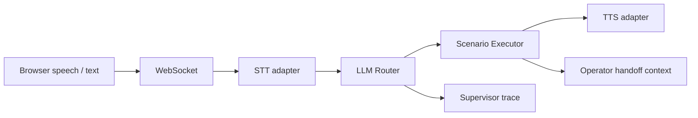

# Voice Router for Halyk Bank

Гибридный голосовой AI-робот для HackAlem AI. Вместо intent-классификатора он использует LLM-маршрутизатор со структурированным решением: сценарий, уверенность, объяснение, альтернативы, язык и извлечённые параметры. Поддерживаются русский, казахский и смешанная речь.

## Запуск

```bash
docker-compose up --build
```

Откройте [http://localhost:5173](http://localhost:5173). Проверка backend: [http://localhost:8000/health](http://localhost:8000/health).

Без ключа запускается детерминированный multilingual fallback-router, поэтому демо работоспособно сразу. Для LLM-режима задайте переменные перед запуском:

```bash
export LLM_API_KEY="your-groq-or-openai-compatible-key"
export LLM_BASE_URL="https://api.groq.com/openai/v1"
export LLM_MODEL="llama-3.3-70b-versatile"
docker-compose up --build
```

Для Edge-TTS включите `ENABLE_TTS=true`. В демо голосовой ввод использует Web Speech API браузера и добавляет распознанную речь в поле ввода, сохраняя уже набранный текст. Пользователь может отредактировать сообщение и отправить его кнопкой отправки или Enter. Текстовый ввод остаётся резервным каналом. `STTService` выделен отдельно для подключения Faster-Whisper, Deepgram или SpeechKit.

## Архитектура

В поле сообщения доступен выбор языка диалога: **Русский**, **Қазақша** или **Смешанный · RU + KZ**. Выбор передаётся серверу вместе с сообщением и задаёт язык ответа. В смешанном режиме можно писать на обоих языках; ответы в текущем демо — на русском. Для голосового ввода в смешанном режиме отдельно выбирается язык каждой записи, поскольку браузерное распознавание использует один язык за раз. Поддержка казахского распознавания зависит от браузера; распознанный текст можно отредактировать перед отправкой.



- `backend/data/scenarios.json` содержит 40 сценариев.
- `context_manager.py` хранит до 10 реплик, стек целей и извлечённые параметры.
- `llm_router.py` запрашивает структурированный JSON у OpenAI-compatible API. При тайм-ауте, ошибке сети или отсутствии ключа переключается на локальный router без остановки диалога.
- `api/websocket.py` публикует единый trace: `scenario_id`, `rationale`, альтернативы, параметры и latency STT/Router/Execution/TTS.
- Жалоба, мошенничество и прямой запрос оператора передают оператору историю, цели и параметры.

## Demo prompts

```text
У меня списали деньги, это не моя операция
Картаңыздағы баланс қанша? И еще как увеличить лимит?
Где моя карта и когда её привезут?
Хочу поговорить с оператором
```

## Целевые показатели

Локальный fallback выполняет маршрутизацию за миллисекунды. Для удалённой LLM установлен тайм-аут `0.45s`, чтобы удерживать ориентир выбора сценария до 500 мс и при задержках провайдера немедленно продолжать в fallback-режиме. Панель оператора показывает измеренное значение для каждого этапа и общее время хода.
